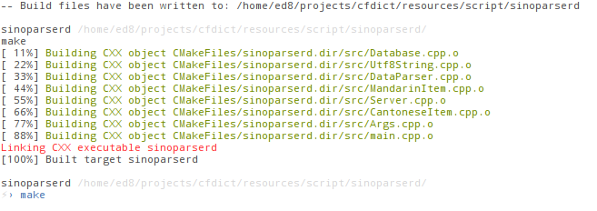

sinoparserd
===========

A service to convert chinese languages (mandarin. cantonese. shanghainese..) into their transliterated form. to segment them etc.

The license only apply to the source code
The data files are provided only as example


### Requirement ###

  * libexpat
  * libevent

### Install ###

If you never used `cmake` have a look at [this tutorial](http://web.cs.swarthmore.edu/~adanner/tips/cmake.php).
```bash
git clone git://github.com/allan-simon/sinoparserd
sudo apt-get install libexpat1{,-dev} libevent-{2.0-5,dev} cmake
cd sinoparserd/ && cmake ./ && make
```
This should output something like:
  > 
### Usage ###

    ./sinoparserd -c path/to/cantone.xml -m path/to/mandarin.xml -p PORT

That will launch an HTTP server listening on port PORT

it provides the following API call, that will return a XML answer

  * /pinyin?str=\*
  * /jyutping?str=\*
  * /change\_script?str=\*
  * /trad?str=\*
  * /simp?str=\*
  * /guess\_script?str=\*
  * /all?str=\*

## License

All the source code is licensed under GPLv3, the xml files are under their own license, it's a "open one" but i need to check which one, certainly CC-BY-SA
so for the moment I would recommend people to use their own data files for "public usage" and use the provided xml only for "test" purpose.

